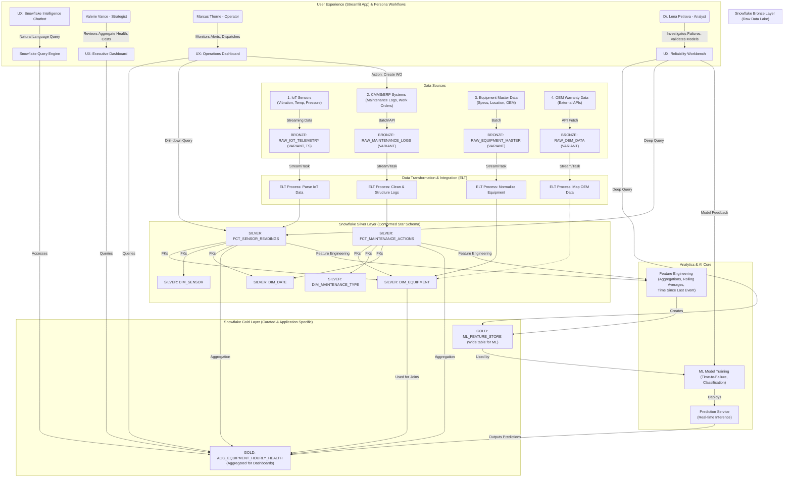

# SnowCore Industries Predictive Maintenance Dashboard

## Overview

The SnowCore Industries Predictive Maintenance Dashboard is an enterprise-grade, AI-powered predictive maintenance solution built on Snowflake. This Streamlit-based application provides real-time monitoring, predictive analytics, and intelligent insights for manufacturing operations across multiple facilities.

The solution leverages Snowflake's native capabilities including:
- **Cortex Analyst** for natural language data queries
- **Snowflake Intelligence Agent** for conversational AI assistance
- **Dynamic Tables** for real-time data processing
- **ML Functions** for predictive modeling
- **Semantic Views** for unified data access

## Key Features

### Multi-View Dashboard
- **Executive Summary**: High-level KPIs, cost trends, asset health overview, and strategic insights
- **OEE Drill-Down**: Overall Equipment Effectiveness (OEE) analysis with availability, performance, and quality metrics
- **Financial Risk Drill-Down**: Budget tracking, cost analysis, and financial risk assessment
- **Asset Detail**: Individual asset inspection, maintenance history, and sensor telemetry
- **Line Visualization**: Interactive production line views with real-time asset status

### AI-Powered Intelligence
- **Unified AI Assistant**: Combines Cortex Analyst and Snowflake Intelligence for natural language queries
- **Semantic Query Engine**: Ask questions about your data in plain English
- **Predictive Analytics**: ML-driven failure prediction and remaining useful life (RUL) estimation
- **Anomaly Detection**: Automatic identification of abnormal sensor readings

### Real-Time Monitoring
- Live telemetry data from 18+ manufacturing assets across 3 facilities
- Temperature, vibration, and pressure sensor monitoring
- Health scores and failure probability calculations
- Production metrics and downtime tracking

### Maintenance Intelligence
- Predictive, preventive, and emergency maintenance tracking
- Parts inventory and usage analysis
- Technician performance and workforce optimization
- Work order management and history

## Application Architecture



## Authentication for Snowflake REST (Cortex Analyst and Intelligence Agent)

This app uses Snowflake Programmatic Access Tokens (PAT) exclusively for HTTP calls to Snowflake REST endpoints. Tokens are resolved with the following precedence (first non-empty wins):

1. `SNOWFLAKE_TOKEN`
2. `SNOWFLAKE_CONNECTIONS_<CONNECTION_NAME>_TOKEN` (if `features.connection_name` is provided in `secrets.toml`)
3. `SNOWFLAKE_TOKEN_FILE_PATH` (contents of the file)
4. `st.secrets["snowflake"]["personal_access_token"]`
5. `st.secrets["snowflake"]["token_file_path"]` (contents of the file)

Headers sent to Snowflake:

```python
{
  "Authorization": "Bearer <token>",
  "Content-Type": "application/json",
  "Accept": "application/json" | "text/event-stream",
  "X-Snowflake-Authorization-Token-Type": "PROGRAMMATIC_ACCESS_TOKEN"
}
```

The base URL is derived from account: `https://<account-with-dashes>.snowflakecomputing.com`.

Reference: Snowflake credential environment variables and PAT guidance in the docs: `https://docs.snowflake.com/en/developer-guide/snowflake-cli/connecting/configure-connections#use-environment-variables-for-snowflake-credentials`.

## Prerequisites

Before deploying the application, ensure you have:

### Software Requirements
- **Snowflake CLI (SnowCLI)**: Version 2.0 or higher
  - Install: `pip install snowflake-cli-labs` or `brew install snowflake-cli`
- **Python**: Version 3.11 (required for Streamlit in Snowflake compatibility)
- **Git**: For cloning the repository

### Snowflake Requirements
- Active Snowflake account with appropriate permissions
- Role with privileges to:
  - Create databases and schemas
  - Create tables, views, and stages
  - Create semantic views (for Cortex Analyst)
  - Create dynamic tables
  - Execute stored procedures
- Snowflake CLI connection configured (connection name: `snowflake_demo_hyperforge` by default)

### Authentication Setup
- **Personal Access Token (PAT)** configured for REST API calls
  - Create PAT in Snowflake: `USE ROLE ACCOUNTADMIN; DESCRIBE USER <your_username>;`
  - Store token securely in environment variables or `.streamlit/secrets.toml`

## Installation & Deployment

### Step 1: Clone the Repository

```bash
git clone https://github.com/sfc-gh-trsmith/predictive_maintenance.git
cd predictive_maintenance
```

### Step 2: Configure Snowflake CLI Connection

Ensure your Snowflake CLI connection is configured. You can verify with:

```bash
snow connection list
```

If you need to create a connection named `snowflake_demo_hyperforge`:

```bash
snow connection add
# Follow prompts to enter:
# - Account identifier
# - Username
# - Authentication method (password/keypair)
# - Role: HYPERFORGE_ROLE (or ACCOUNTADMIN initially)
# - Warehouse: HYPERFORGE_WH
# - Database: HYPERFORGE
# - Schema: GOLD
```

### Step 3: Run the Deployment Script

The deployment script automates the entire setup process:

```bash
chmod +x deploy.sh
./deploy.sh
```

**What the deployment script does:**

1. **Creates Database Infrastructure** (`setup/HYPERFORGE_PREDICTIVE_MAINTENANCE.sql`):
   - Creates `HYPERFORGE` database with roles and warehouses
   - Sets up Bronze (RAW), Silver, and Gold schemas
   - Creates dimension tables: DIM_ASSET, DIM_PLANT, DIM_PRODUCTION_LINE, DIM_OEM, etc.
   - Creates fact tables: FCT_ASSET_TELEMETRY, FCT_MAINTENANCE_LOG, FCT_PRODUCTION_LOG, etc.
   - Generates synthetic data from September 1, 2025 to current date
   - Builds Gold layer aggregations: AGG_ASSET_HOURLY_HEALTH, ML_FEATURE_STORE
   - Creates dynamic tables for real-time data processing

2. **Uploads Semantic View Definition**:
   - Uploads `setup/HYPERFORGE_SV.yaml` to `@SEMANTIC_VIEW_STAGE`
   - Defines semantic model for Cortex Analyst natural language queries

3. **Creates Semantic View**:
   - Executes `SYSTEM$CREATE_SEMANTIC_VIEW_FROM_YAML()`
   - Enables natural language querying via Cortex Analyst

4. **Grants Permissions**:
   - Configures role-based access control
   - Grants necessary privileges to HYPERFORGE_ROLE

### Step 4: Configure Streamlit Secrets

Create a `.streamlit/secrets.toml` file in the project root:

```toml
[snowflake]
account = "your-account-identifier"
user = "your-username"
role = "HYPERFORGE_ROLE"
warehouse = "HYPERFORGE_WH"
database = "HYPERFORGE"
schema = "GOLD"

# Authentication for REST API calls (Cortex Analyst)
personal_access_token = "your-personal-access-token"

# Optional: Alternative authentication
# token_file_path = "/path/to/token/file"

[features]
# Optional: Named connection for token resolution
# connection_name = "snowflake_demo_hyperforge"
```

Alternatively, use environment variables:

```bash
export SNOWFLAKE_ACCOUNT="your-account-identifier"
export SNOWFLAKE_USER="your-username"
export SNOWFLAKE_ROLE="HYPERFORGE_ROLE"
export SNOWFLAKE_WAREHOUSE="HYPERFORGE_WH"
export SNOWFLAKE_DATABASE="HYPERFORGE"
export SNOWFLAKE_SCHEMA="GOLD"
export SNOWFLAKE_TOKEN="your-personal-access-token"
```

### Step 5: Install Python Dependencies

```bash
# Create virtual environment (optional but recommended)
python3.11 -m venv venv
source venv/bin/activate  # On Windows: venv\Scripts\activate

# Install dependencies
pip install -r environment.yaml
# Or install packages individually:
pip install snowflake-ml-python snowflake-connector-python pandas requests PyJWT cryptography streamlit streamlit-option-menu
```

### Step 6: Run the Application

```bash
streamlit run app.py
```

The application will open in your default browser at `http://localhost:8501`.

## Data Model

The application uses a three-tier medallion architecture:

### Bronze Layer (Raw Data)
- `RAW_IOT_TELEMETRY`: Raw sensor data (VARIANT format)
- `RAW_MAINTENANCE_LOGS`: Raw maintenance records
- `RAW_EQUIPMENT_MASTER`: Equipment specifications
- `RAW_OEM_DATA`: OEM warranty and specifications

### Silver Layer (Conformed Star Schema)
**Dimensions:**
- `DIM_ASSET`: Asset master data (18 assets across 3 facilities)
- `DIM_PLANT`: Plant locations (Davidson, Charlotte)
- `DIM_PRODUCTION_LINE`: 9 production lines
- `DIM_OEM`: Original equipment manufacturers (Siemens, ABB, Emerson, etc.)
- `DIM_SENSOR`: Sensor types and specifications
- `DIM_MAINTENANCE_TYPE`: Work order types
- `DIM_TECHNICIAN`: Maintenance workforce (10 technicians)
- `DIM_MATERIAL`: Parts and materials inventory
- `DIM_DATE`: Date dimension
- `DIM_BUDGET`: Budget planning and tracking

**Facts:**
- `FCT_ASSET_TELEMETRY`: Hourly sensor readings (temperature, vibration, pressure)
- `FCT_MAINTENANCE_LOG`: Maintenance events and work orders
- `FCT_PRODUCTION_LOG`: Daily production metrics and OEE
- `FCT_MAINTENANCE_PARTS_USED`: Parts consumption per work order

### Gold Layer (Application-Specific Cubes)
- `AGG_ASSET_HOURLY_HEALTH`: Hourly asset health aggregations
- `ML_FEATURE_STORE`: Daily ML features for predictive modeling
- `HYPERFORGE_SV`: Semantic view for Cortex Analyst queries

## Application Usage

### Navigation
Use the horizontal menu at the top to switch between views:
- 🏢 **Executive Summary**: Strategic overview and KPIs
- 📉 **OEE Drill-Down**: Equipment effectiveness analysis
- 💰 **Financial Risk Drill-Down**: Budget and cost analysis
- 🔍 **Asset Detail**: Detailed asset inspection
- 🗺️ **Line Visualization**: Interactive production line maps

### AI Assistant (Right Panel)
The unified assistant supports two modes:

1. **Semantic Query (Cortex Analyst)**:
   - Structured data queries in natural language
   - Example: "What is the average health score for assets at Davidson plant?"
   - Uses the semantic view for accurate SQL generation

2. **General Questions (Intelligence Agent)**:
   - Conversational AI for insights and recommendations
   - Example: "What should I prioritize for maintenance this week?"
   - Provides contextual analysis and recommendations

### Sample Questions

See `ANALYST_QUESTIONS.md` for 100+ example questions you can ask, including:
- Budget and financial analysis
- Asset health monitoring
- Maintenance activity tracking
- Production and OEE metrics
- Sensor telemetry analysis
- Parts and materials management
- Predictive risk analysis
- Technician workforce optimization

## Data Generation

The application includes synthetic data generation for demonstration purposes:

- **Time Range**: September 1, 2025 to current date (dynamic)
- **Hourly Telemetry**: ~22,000+ records (18 assets × 24 hours × days)
- **Maintenance Events**: ~450-550 records with realistic patterns
- **Production Logs**: ~918+ records (18 assets × days)
- **Parts Usage**: ~900-1,500 records

Data generation details are documented in `setup/DATA_GENERATION_SUMMARY.md`.

## Troubleshooting

### Common Issues

**1. Deployment Script Fails**
```bash
# Verify Snowflake CLI connection
snow connection test --connection snowflake_demo_hyperforge

# Check permissions
snow sql --connection snowflake_demo_hyperforge -q "SHOW GRANTS TO ROLE HYPERFORGE_ROLE;"
```

**2. Streamlit Authentication Errors**
- Verify Personal Access Token is valid and not expired
- Check token permissions include database and schema access
- Ensure token is correctly set in secrets.toml or environment variables

**3. Cortex Analyst Not Working**
- Verify semantic view was created: `SHOW SEMANTIC VIEWS IN SCHEMA HYPERFORGE.GOLD;`
- Check stage contents: `LIST @HYPERFORGE.GOLD.SEMANTIC_VIEW_STAGE;`
- Ensure role has USAGE privilege on semantic view

**4. Missing Dependencies**
```bash
# Reinstall dependencies
pip install --upgrade -r environment.yaml
```

**5. Data Not Loading**
```bash
# Verify tables contain data
snow sql --connection snowflake_demo_hyperforge -q "SELECT COUNT(*) FROM HYPERFORGE.SILVER.FCT_ASSET_TELEMETRY;"
```

## Development

### Project Structure
```
predictive_maintenance/
├── app.py                      # Main Streamlit application
├── deploy.sh                   # Deployment automation script
├── environment.yaml            # Python dependencies
├── README.md                   # This file
├── ANALYST_QUESTIONS.md        # Sample questions for AI assistant
├── setup/
│   ├── HYPERFORGE_PREDICTIVE_MAINTENANCE.sql  # Main database setup
│   ├── HYPERFORGE_SV.yaml      # Semantic view definition
│   ├── CREATE_CORTEX_ANALYST_STAGE.sql
│   └── DATA_GENERATION_SUMMARY.md
├── utils/
│   ├── calculations.py         # Business logic and calculations
│   ├── cortex_analyst.py       # Cortex Analyst integration
│   ├── data_loader.py          # Snowflake data loading utilities
│   ├── snowflake_intelligence.py  # Intelligence Agent integration
│   └── unified_assistant.py    # Unified AI assistant widget
└── views/
    ├── executive_summary.py    # Executive dashboard view
    ├── oee_drilldown.py        # OEE analysis view
    ├── financial_risk.py       # Financial analysis view
    ├── asset_detail.py         # Asset detail view
    └── line_visualization.py   # Production line visualization
```

### Adding New Features

1. **New Dashboard View**: Create a new file in `views/` with a `show_page()` function
2. **New Data Source**: Add to Bronze layer and create transformation logic
3. **New Metrics**: Update Gold layer aggregations and feature store
4. **New AI Capabilities**: Extend semantic view YAML with new entities and relationships

## Production Deployment

For production deployment to Snowflake Native Apps or Streamlit in Snowflake (SPCS):

1. **Streamlit in Snowflake**: Upload application files to a stage and create Streamlit app
   ```sql
   CREATE STREAMLIT HYPERFORGE.GOLD.PREDICTIVE_MAINTENANCE_APP
     ROOT_LOCATION = '@HYPERFORGE.GOLD.STREAMLIT_STAGE'
     MAIN_FILE = 'app.py'
     QUERY_WAREHOUSE = 'HYPERFORGE_WH';
   ```

2. **Snowflake Native App**: Package as a Snowflake Native Application for distribution


## Support

For issues, questions, or feature requests:
- Review `ANALYST_QUESTIONS.md` for usage examples
- Check `setup/DATA_GENERATION_SUMMARY.md` for data model details
- Consult Snowflake documentation: https://docs.snowflake.com

## Version History

- **v1.0** (October 2025): Initial release with multi-view dashboard and AI assistant
  - Executive Summary, OEE, Financial Risk, Asset Detail, Line Visualization views
  - Cortex Analyst and Intelligence Agent integration
  - Dynamic data generation for 18 assets across 3 facilities
  - ML feature store for predictive analytics
